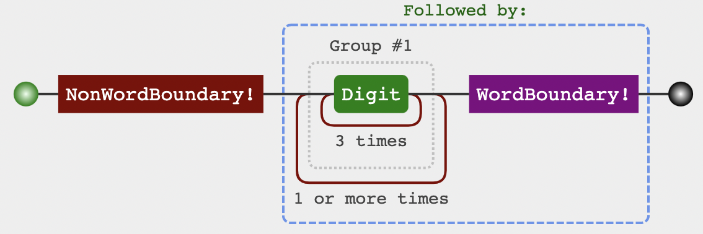

# 正则表达式入门

参考来源：[JS正则表达式完整教程](https://juejin.cn/post/6844903487155732494)


## 介绍

正则表达式其实就是一门工具，是一种**用来描述规则的表达式**，**目的**是为了字符串模式匹配，从而实现搜索和替换功能。

正则表达式是匹配模式，要么匹配字符，要么匹配位置。

可以利用工具很好地可视化自己写的正则表达式：

[可视化正则表达式](https://regexper.com/)

[可视化正则](https://jex.im/regulex/#!flags=&re=)


#### 修饰语

| 修饰语 |    作用    |
| :----: | :--------: |
|   i    | 忽略大小写 |
|   g    |  全局搜索  |
|   m    |    多行    |


#### 相关操作api

| api            | 作用                              |
| -------------- | --------------------------------- |
| String#search  | 查找是否包含，返回找到的位置index |
| String#split   | 按照某个正则表达式将字符串分隔开  |
| String#match   | 返回你所匹配到的内容              |
| String#replace | 替换字符串中的匹配内容            |
| RegExp#test    | 测试是否包含，返回一个boolean变量 |
| RegExp#exec    | 实现匹配全局，并返回分组的结果    |


## **匹配字符**

### 精确匹配

精确匹配字面量

**字面量**，匹配一个具体字符，包括不用转义的和需要转义的。比如a匹配字符"a"，又比如\n匹配换行符，又比如\.匹配小数点。

```js
var regex = /hello/;
console.log(regex.test("hello")); 
// => true
```


### 模糊匹配

#### 横向模糊匹配

- 可匹配的字符串的长度不是固定的
- 通过使用量词来实现


例 `{m,n}`：连续出现最少m次，最多n次。

```js
var regex = /ab{2,5}c/g;
var string = "abc abbc abbbc abbbbc abbbbbc abbbbbbc";
console.log(string.match(regex)); 
// => ["abbc", "abbbc", "abbbbc", "abbbbbc"]
```

可视化：[/ab{2,5}c/g](https://jex.im/regulex/#!flags=&re=ab%7B2%2C5%7Dc)


##### 量词

| 字符  | 描述                                                         |
| :---- | :----------------------------------------------------------- |
| *     | 匹配0~n位字符。如 /b*/g，就是可以不出现b，也可以出现一次或多次。 |
| +     | 匹配1~n位字符。如 /b+/g，就是至少出现一次b。                 |
| ?     | ？之前字符可选，0或1位。如 /colou?r/g，就是可以匹配color或colour。 |
| {n}   | 匹配确定的 n 位。例如，'o{2}' 不能匹配 "Bob" 中的 'o'，但是能匹配 "food" 中的两个 o。 |
| {n,}  | 至少匹配 n 位。例如，'o{2,}' 不能匹配 "Bob" 中的 'o'，但能匹配 "foooood" 中的所有 o。'o{1,}' 等价于 'o+'。'o{0,}' 则等价于 'o*'。 |
| {n,m} | 匹配n~m位字符。如 /b{n,m}/g，就是最少出现n次b，最多出现m次b。 |


#### 纵向模糊匹配

- 匹配字符串，具体到某一位字符时，可以有多种可能
- 使用字符组[]来实现


例 `[abc]`：匹配abc中的一个

```js
var regex = /1[abc]2/g;
var string = "1a2 1b2 1c2 1d2 1e2";
console.log( string.match(regex) ); 
// => ["1a2", "1b2", "1c2"]
```

可视化：[/1[abc]2/g](https://regexper.com/#%2F1%5Babc%5D2%2Fg)


##### 字符组

1、排除字符组

字符组的第一位放`^`（脱字符），表示求反的概念。

例如`[^abc]`，表示是一个除"a"、"b"、"c"之外的任意一个字符。

2、范围表示法

用连字符`-`来省略和简写。

比如`[123456abcdefGHIJKLM]`，可以写成`[1-6a-fG-M]`。

3、常见简写

| 简写 |                             作用                             |
| :--: | :----------------------------------------------------------: |
|  \w  |             word的简写。匹配字母、数字、下划线。             |
|  \W  |                  匹配非字母、数字、下划线。                  |
|  \s  | space的简写。匹配任意的空白符，包括空格、制表符、换行符、回车符、换页符。 |
|  \S  |                        匹配非空白符。                        |
|  \d  |                   digit的简写。匹配数字。                    |
|  \D  |                         匹配非数字。                         |
|  .   |         匹配任意除了换行符（回车键）之外的单个字符。         |

**匹配任意字符：**可以使用[\d\D]、[\w\W]、[\s\S]和[^]中任何的一个。


### 贪婪匹配 和 惰性匹配

#### 量词的匹配

**{m,n}默认是贪婪匹配，它会尽可能多的匹配**

```js
var regex = /\d{2,5}/g;
var string = "123 1234 12345 123456";
console.log( string.match(regex) ); 
// => ["123", "1234", "12345", "12345"]
```

正则`/\d{2,5}/`，表示数字连续出现2到5次。会匹配2位、3位、4位、5位连续数字。


**惰性匹配，就是尽可能少的匹配。通过在量词后面加个问号就能实现惰性匹配。**

```js
var regex = /\d{2,5}?/g;
var string = "123 1234 12345 123456";
console.log( string.match(regex) ); 
// => ["12", "12", "34", "12", "34", "12", "34", "56"]
```

其中`/\d{2,5}?/`表示，虽然2到5次都行，当2个就够的时候，就不在往下尝试了。


#### 分支结构的匹配

##### 多选分支

多选分支可以支持多个子模式任选其一。

具体形式如下：`(p1|p2|p3)`，其中`p1`、`p2`和`p3`是子模式，用`|`（管道符）分隔，表示其中任何之一。

例如要匹配"good"和"nice"可以使用`/good|nice/`。测试如下：

```js
var regex = /good|nice/g;
var string = "good idea, nice try.";
console.log( string.match(regex) ); 
// => ["good", "nice"]
```


**分支结构属于惰性匹配。  如果前面的匹配上了，后面就不再尝试了**

```js
var regex = /good|goodbye/g;
var string = "goodbye goodnight";
console.log( string.match(regex) ); 
// => ["good", "good"]
```


```js
var regex = /goodbye|good/g;
var string = "goodbye goodnight";
console.log( string.match(regex) ); 
// => ["goodbye", "good"]
```


### 示例

#### 匹配16进制颜色值

```js
var regex = /#([0-9a-fA-F]{6}|[0-9a-fA-F]{3})/g;
var string = "#ffbbad #Fc01DF #FFF #ffE";
console.log( string.match(regex) ); 
// => ["#ffbbad", "#Fc01DF", "#FFF", "#ffE"]
```


## **匹配位置**

### 锚点

匹配一个位置，而不是字符。

|     锚点     |                             作用                             |
| :----------: | :----------------------------------------------------------: |
|      ^       |              匹配开头，在多行匹配中匹配行开头。              |
|      $       |              匹配结尾，在多行匹配中匹配行结尾。              |
|      \b      | 匹配单词的开始和结束也包括`\w`和`^`之间的位置，也包括`\w`和`$`之间的位置。 |
|      \B      |                          非单词边界                          |
| (?=pattern)  |             正向先行断言，匹配pattern前面的位置              |
| (?!pattern)  |           反向先行断言，匹配不是pattern前面的位置            |
| (?<=pattern) |             正向后行断言，匹配pattern后面的位置              |
| (?<!pattern) |           反向后行断言，匹配不是pattern后面的位置            |


### 开始 ^ 结束 $

例：将字符串的开头和结尾用"#"替换（位置也可以替换成字符）

```js
var result = "hello".replace(/^|$/g, '#');
console.log(result); 
// => "#hello#"
```

多行匹配模式时，二者是行的概念，这个需要我们的注意：

```js
var result = "How\nare\nyou".replace(/^|$/gm, '#');
console.log(result);
/*
#How#
#are#
#you#
*/
```


### 单词边界 \b \B

```js
var result = "Hey!Good morning".replace(/\b/g, '#');
console.log(result); 
// => "#Hey#!#Good# #morning#"
```

```js
var result = "Hey!Good morning".replace(/\B/g, '#');
console.log(result); 
// => "H#e#y!G#o#o#d m#o#r#n#i#n#g"
```


### 正向先行断言 (?=pattern)

匹配pattern前面的位置

```js
var result = "goodbye".replace(/(?=good)/g, '#');
console.log(result); 
// => "#goodbye"
```


### 反向先行断言 (?!pattern)

匹配不是pattern前面的位置，与上述匹配相反的位置

```js
var result = "goodbye".replace(/(?!good)/g, '#');
console.log(result); 
// => "g#o#o#d#b#y#e#"
```


### 正向后行断言 (?<=pattern)

匹配pattern后面的位置

```js
var result = "goodbye".replace(/(?<=good)/g, '#');
console.log(result); 
// => "good#bye"
```


### 反向后行断言 (?<!pattern)

匹配不是pattern后面的位置，与上述匹配相反的位置

```js
var result = "goodbye".replace(/(?<!good)/g, '#');
console.log(result); 
// => "#g#o#o#db#y#e#"
```


### 示例

#### 不匹配任何东西的正则

`/.^/`  匹配开头前面的任意字符

#### 金额的千位分隔符表示法

 ```js
var string = "12345678.12 123456789.12",
reg = /\B(?=(\d{3})+\b)/g;

var result = string.replace(reg, ',')
console.log(result); 
// => "12,345,678.12 123,456,789.12"
 ```

可视化：[/\B(?=(\d{3})+\b)/g](https://jex.im/regulex/#!flags=&re=%5CB(%3F%3D(%5Cd%7B3%7D)%2B%5Cb)




## 分组（括号的使用）

我们知道`/a+/`匹配连续出现的“a”，而要匹配连续出现的“ab”时，需要使用`/(ab)+/`。

其中括号是提供分组功能，使量词`+`作用于“ab”这个整体，测试如下：

```
var regex = /(ab)+/g;
var string = "ababa abbb ababab";
console.log( string.match(regex) ); 
// => ["abab", "ab", "ababab"]
```


### 引用分组

一个括号表示一个分组，通过`$1`、`$2`引用分组

比如，想把yyyy-mm-dd格式，替换成mm/dd/yyyy怎么做？

```js
var regex = /(\d{4})-(\d{2})-(\d{2})/;
var string = "2021-08-19";
var result = string.replace(regex, "$2/$3/$1");
console.log(result); 
// => "06/12/2017"
```

其中`replace`中的，第二个参数里用`$1`、`$2`、`$3`指代相应的分组。


### 反向引用

除了使用相应API来引用分组，也可以在**正则本身里引用分组**。但只能引用之前出现的分组，即反向引用。

通过`\1`、`\2`进行引用  `\0`则表示整个表达式

例：匹配成对标签

```js
var regex = /<([^>]+)>[\d\D]*<\/\1>/;
var string1 = "<title>regular expression</title>";
var string2 = "<p>laoyao bye bye</p>";
var string3 = "<title>wrong!</p>";
console.log( regex.test(string1) ); // true
console.log( regex.test(string2) ); // true
console.log( regex.test(string3) ); // false
```


### 非捕获分组

` (?:pattern)` 非捕获分组匹配的值不会保存起来。 只保留括号最原始的功能，不会引用它。

即，既不在API里引用，也不在正则里反向引用。

```js
var regex = /(?:ab)+/g;
var string = "ababa abbb ababab";
console.log(string.match(regex)); 
// => ["abab", "ab", "ababab"]
```


### 示例

####  将每个单词的首字母转换为大写

```js
function titleize(str) {
	return str.toLowerCase().replace(/(?:^|\s)\w/g, function(c) {
		return c.toUpperCase();
	});
}
console.log(titleize('my name is ccc') ); 
// => "My Name Is Ccc"
```


## 其他

### 操作符优先级

操作符的优先级从上至下，由高到低：

1.转义符 \

2.括号和方括号 (...)、(?:...)、(?=...)、(?!...)、(?<=...)、(?<!...)、[...]

3.量词限定符 {m}、{m,n}、{m,}、?、*、+

4.位置和序列 ^ 、$、 \元字符、 一般字符

5.管道符（竖杠）|


### 示例

#### 匹配 ipv4

`/^((0{0,2}\d|0?\d{2}|1\d{2}|2[0-4]\d|25[0-5])\.){3}(0{0,2}\d|0?\d{2}|1\d{2}|2[0-4]\d|25[0-5])$/`


结构：`((...)\.){3}(...)`

它是一个多选结构，分成5个部分：

- `0{0,2}\d`，匹配一位数，包括0补齐的。比如，9、09、009；
- `0?\d{2}`，匹配两位数，包括0补齐的，也包括一位数；
- `1\d{2}`，匹配100到199;
- `2[0-4]\d`，匹配200-249；
- `25[0-5]`，匹配250-255。


## 拓展阅读

《JavaScript权威指南》 第10章

《高性能JavaScript》 第5章

《JavaScript高级程序设计》 第5.4节 