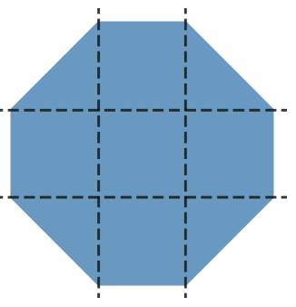
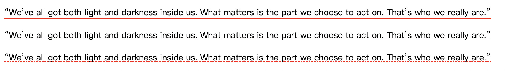

# 《CSS揭秘》学习笔记

## DRY原则

全名`Don't Repeat Yourself`，该原则适用于所有编程语言而不限于css。


## 原书所有示例

http://play.csssecrets.io/


## 一、背景与边框

示例：https://codepen.io/csmsimona/pen/VwxEVEN

### 半透明边框

**background-clip** 规定背景的绘制区域，默认值border-box，即默认作用到边框范围。

我们将其值设置为padding-box，**让背景限制在内边框（padding）内，让实色背景不影响半透明边框（border）**。

```css
.test1 {
  border: 10px solid rgba(255,255,255,0.2);
  background-clip: padding-box;
}
```


https://developer.mozilla.org/zh-CN/docs/Web/CSS/background-clip

> 指定背景绘制区域：
> background-clip: border-box|padding-box|content-box;
>
> - border-box：默认值。背景延伸至边框外沿（但是在边框下层）。
> - padding-box：背景延伸至内边距（[`padding`](https://developer.mozilla.org/zh-CN/docs/Web/CSS/padding)）外沿。不会绘制到边框处。
> - content-box：背景被裁剪至内容区（content box）外沿。
> - text：背景被裁剪成文字的前景色。


### 实现多重边框

#### 1、box-shadow  实现多重边框

**box-shadow** 它支持逗号分隔语法，所以可以创建任意数量的投影。它们是层层叠加的，第一层投影位于最顶层，依次类推。因此，你需要按此规律调整扩张半径

```css
.test2 {
  box-shadow: 0 0 0 10px red,
    0 0 0 20px green,
    0 0 0 30px blue;
}
```

注意：只能实现实线边框，不影响布局，也不会受到box-sizing属性的影响，可以通过内边距或外边距来额外模拟出边框所需要占据的空间；不响应鼠标事件，可以给box-shadow 属性加上 inset 关键字，来使投影绘制在元素的内圈。


> 盒子阴影：box-shadow: h-shadow v-shadow blur spread color inset;
>
> - h-shadow 必需的。水平阴影的位置。允许负
> - v-shadow 必需的。垂直阴影的位置。允许负值
> - blur 可选。模糊距离
> - spread 可选。阴影的大小
> - color 可选。阴影的颜色。在CSS颜色值寻找颜色值的完整列表
> - inset 可选。从外层的阴影（开始时）改变阴影内侧阴影


#### 2、outline  实现两层边框

先设置一层常规边框，再加上outline属性来产生外层的边框

**outline** 绘制于元素周围的一条线，位于边框边缘的外围

注意：只有两层，不能接受由逗号分隔的多个值；不一定贴合圆角（chrome贴合 safari不贴合） 

```css
.test3 {
  border: 10px solid red;
  outline: 10px solid green;
}
```


可配合outline-offset实现缝边效果

```css
.test4 {
  outline: 1px dashed green;
  outline-offset: -5px;
}
```


### 背景定位

#### 1、background-position

任意偏离

```css
.test5 {
  background: url('./show.png') no-repeat blue;
  background-position: right 20px bottom 20px;
}
```

#### 2、background-origin

有“背景图片起点”的意思。告诉浏览器background-position是相对于哪里定位的，默认为padding-box

```css
.test5 {
  background: url('./show.png') no-repeat blue;
  background-position: right 20px bottom 20px;
	background-origin: content-box;
}
```

#### 3、calc

```css
.test5 {
  background: url('./show.png') no-repeat blue;
  background-position: calc(100% - 20px) calc(100% - 20px);
}
```


### 实现条纹背景

#### 1、水平条纹

background:linear-gradient  各色标设置相同的位置  消除渐变

> 如果多个色标具有相同的位置，它们会产生一个无限小的过渡区域，过渡的起止色分别是第一个和最后一个指定值。从效果上看，颜色会在那个位置突然变化，而不是一个平滑的渐变过程。  ——CSS图像（第三版）

background-size 控制大小

```css
.test6 {
  width: 200px;
  height: 200px;
  background: linear-gradient(#fb3 50%, #58a 50%);
  background-size: 100% 40px;
}
```


#### 2、垂直条纹

to right 或 90deg

```css
.test7 {
  height: 200px;
  background: linear-gradient(to right, #fb3 50%, #58a 50%);
/*   background: linear-gradient(90deg, #fb3 50%, #58a 50%); */
  background-size: 40px 100%;
}
```


#### 3、斜向条纹

**45°倾斜条纹**

设置四条条纹，旋转45°

```css
.test8 {
  height: 200px;
  /*  如果某个色标的位置值比整个列表中在它之前的色标的位置值都要小，则该色标的位置值会被设置为它前面所有色标位置值的最大值 */
  /* 即 '#58a 0' 等价于 '#58a 25%' */
	background: linear-gradient(45deg, #fb3 25%, #58a 0, #58a 50%, #fb3 0, #fb3 75%, #58a 0);
  background-size: 40px 40px; 
}
```


**任意角度倾斜条纹**

repeating-linear-gradient：重复线性渐变，linear-gradient的循环加强版。色标无限循环重复，直到填满整个背景

在渐变的色标中指定长度

```css
.test9 {
  height: 200px;
  /*  第二个色标的位置值设置为0，那它的位置就总是会被浏览器调整为前一个色标的位置值 */
  background: repeating-linear-gradient(60deg, #fb3 0, #fb3 15px, #58a 0, #58a 30px) 
}
```


[复杂的背景图案库（CSS版）](https://projects.verou.me/css3patterns/)

[复杂的背景图案库（SVG版）](https://philiprogers.com/svgpatterns/)


### 连续的图像边框

1.在背景图片之上，再叠加一层纯白的实色背景

2.给两层背景指定不同的background-clip

3.设置background-origin为 border-box

```css
.test10 {
  border: 10px solid transparent;
  background: linear-gradient(white, white), url('./show.png');
  background-size: cover;
  background-clip: padding-box, border-box;
  background-origin: border-box;
}
```

简写

```css
.test10 {
  border: 10px solid transparent;
  background: linear-gradient(white, white) padding-box,
  url('./show.png') border-box 0 0 / cover;
}
```


### 老式信封边框

斜向条纹+图像边框

```css
.test11 {
  border: 10px solid transparent;
  background: 
    linear-gradient(white, white) padding-box,
  repeating-linear-gradient(-45deg,
  red 0, red 12.5%,
  #fff 0, #fff 25%,
  #58a 0, #58a 37.5%,
  #fff 0, #fff 50%);
  background-size: 40px 40px;
}
```


### 蚂蚁行军边框

```css
@keyframes ants { to { background-position: 100% 100% } }
.test12 {
  border: 1px solid transparent;
  background: 
    linear-gradient(#fff, #fff) padding-box,
  repeating-linear-gradient(-45deg,
  #000 0, #000 25%,
  #fff 0, #fff 50%);
  background-size: 10px 10px;
  animation: ants 12s linear infinite;
}

```


## 二、形状

示例：https://codepen.io/csmsimona/pen/QWrJyOa

### 椭圆

#### 1、自适应椭圆

根据其内容自动调整并适应。如果它的宽高相等，就显示为一个圆；如果宽高不等，就显示为一个椭圆

```css
border-radius: 50%;
```

#### 2、上半椭圆

border-radius还可以单独指定水平半径和垂直半径，只要用一个斜杠（/）分隔即可


- 这个形状是垂直对称的，这意味着左上角和右上角的半径值应该是相同的；与此类似，左下角和右下角的半径值也应该是相同的。 

- „顶部边缘并没有平直的部分（也就是说，整个顶边都是曲线），这意味着左上角和右上角的半径之和应该等于整个形状的宽度。

- 基于前两条观察，我们可以推断出，左半径和右半径在水平方向上的值应该均为 50%。
- 再看看垂直方向，似乎顶部的两个圆角占据了整个元素的高度，而且底部完全没有任何圆角。因此，在垂直方向上 border-radius 的合理值似乎就是 100% 100% 0 0
- 因为底部两个角的垂直圆角是零，那么它们的水平圆角是多少就完全不重要了，因为此时水平圆角总是会被计算为零。

```css
border-radius: 50% / 100% 100% 0 0;
```


#### 3、左半椭圆

```css
border-radius: 100% 0 0 100% / 50%;
```


#### 4、四分之一椭圆

其中一个角的水平和垂直半径值都需要是100%，而其他三个角都不能设为圆角

```css
border-radius: 100% 0 0 0;
```


### 平行四边形

```css
transform: skewX(-45deg);
```

但是内容也倾斜了


如何只让容器的形状倾斜，而保持其内容不变？

#### 1、嵌套元素方案

对内容再应用一次反向的 **skew()** 变形，从而抵消容器的变形效果

```css
.example5 {
  transform: skewX(-45deg);
}
.example5 > span {
  display: inline-block;
  transform: skewX(45deg);
}
```


如果你想把这个效果应用到一个默认显示为行内的元素，不要忘记把它的 display 属性设置为 其他值， 比 如 inline-block或 block，否则变形是不会生效的。

#### 2、伪元素方案

把所有样式（背景、边框等）应用到伪元素上，然后再对伪元素进行变形

因为我们的内容并不是包含在伪元素里的，所以内容并不会受到变形的影响


- 给宿主元素应用 position: relative 样式，并为伪元素设置 position: absolute，然后再把所有偏移量设置为零，以便让它在水平和垂直方向上都被拉伸至宿主元素的尺寸。
- 用伪元素生成的方块是重叠在内容之上的，一旦给它设置背景，就会遮住内容我们可以给伪元素设置z-index: -1 样式，这样它的堆叠层次就会被推到宿主元素之后。
- 对伪元素进行各种变形

```css
.example6 {
  position: relative;
  background: transparent;
}
.example6::before {
  content: '';
  position: absolute;
  top: 0;
  bottom: 0;
  left: 0;
  right: 0;
  z-index: -1;
  background: orange;
  transform: skewX(45deg);
}
```


### 菱形图片

#### 1、基于变形的方案


```css
.example7 {
  width: 100px;
  height: 100px;
  transform: rotate(45deg);
  overflow: hidden;
  background: transparent;
}

.example7 > img {
  max-width: 100%;
  transform: rotate(-45deg) scale(2);
}
```

#### 2、裁剪路径方案

使用 clip-path 属性

使用 polygon()（多边形）函数来指定一个菱形。它允许我们用一系列（以逗号分隔的）坐标点来指定任意的多边形

坐标点按上右下左的顺时针顺序呈现

```css
clip-path: polygon(50% 0, 100% 50%, 50% 100%, 0 50%);
```


图片在鼠标悬停时平滑地扩展为完整的面积的效果

```css
.example8 {
  clip-path: polygon(50% 0, 100% 50%, 50% 100%, 0 50%);
  transition: 1s clip-path;
}

.example8:hover {
 clip-path: polygon(0 0, 100% 0, 100% 100%, 0 100%);
}
```


### 切角效果

#### 1、渐变方案

把一个透明色标放在切角处，然后在相同位置设置另一个色标，并且把它的颜色设置为我们想要的背景色

```css
background: linear-gradient(-45deg, transparent 15px, orange 0);
```


**设置两个切角**

```css
.example10 {
  background:
    linear-gradient(-45deg, transparent 15px, orange 0),
    linear-gradient(45deg, transparent 15px, orange 0);
  /*上面的情况，这两层渐变会默认填满整个元素，因此它们会相互覆盖。

  使用 background-size 让每层渐变分别只占据整个元素一半的面积：*/
  background:
    linear-gradient(-45deg, transparent 15px, #58a 0) right,
    linear-gradient(45deg, transparent 15px, #655 0) left;
  background-size: 50% 100%;
  background-repeat: no-repeat;
}
```


**设置四个切角**

```css
.example11 {
  /*  四半渐变组合  */
  background:
    linear-gradient(135deg, transparent 15px, orange 0) top left,
    linear-gradient(-135deg, transparent 15px, orange 0) top right,
    linear-gradient(-45deg, transparent 15px,orange 0) bottom right,
    linear-gradient(45deg, transparent 15px, orange 0) bottom left;
  background-size: 50% 50%;
  background-repeat: no-repeat;
}
```


**内凹圆角**

用径向渐变来替代上述线性渐变

```css
.example12 {
  background:
    radial-gradient(circle at top left,transparent 15px, orange 0) top left,
    radial-gradient(circle at top right,transparent 15px, orange 0) top right,
    radial-gradient(circle at bottom right,transparent 15px, orange 0) bottom right,
    radial-gradient(circle at bottom left,transparent 15px, orange 0) bottom left;
  background-size: 50% 50%;
  background-repeat: no-repeat;
}
```


#### 2、内联 SVG 与 border-image方案

border-image 属性可以通过一些简单的规则，将一副图像划分为 9 个单独的部分，浏览器会自动使用相应的部分来替换边框的默认样式


使用 border-image，并通过一个内联的 SVG 图像来产生切角效果



- 使用的切片尺寸是 1，这并不表示 1 像素，它所对应的是SVG 文件的坐标系统（因此不需要单位）
- fill关键词添加背景色
- 加上background-clip避免背景色蔓延到边框区域

```css
.example13 {
  border: 20px solid transparent;
  /* 造一个类上图的八边形 */
	border-image: 1 url('data:image/svg+xml,\
 <svg xmlns="http://www.w3.org/2000/svg" width="3" height="3" fill="orange">\
 <polygon points="0,1 1,0 2,0 3,1 3,2 2,3 1,3 0,2"/>\
 </svg>');
  background: orange;
  background-clip: padding-box;
}
```


#### 3、裁切路径

```css
.example14 {
  background: orange;
  clip-path: polygon(
    20px 0, calc(100% - 20px) 0,
    100% 20px, 100% calc(100% - 20px),
    calc(100% - 20px) 100%, 20px 100%,
    0 calc(100% - 20px), 0 20px
  );
}
```


#### 未来

CSS 背景与边框（第四版）（http://dev.w3.org/csswg/css-backgrounds-4/）将引入一个全新的属性 corner-shape，可以彻底解决这个痛点。这个属性需要跟 border-radius 配合使用，从而产生各种不同形状的切角效果，而切角的尺寸正是 border-radius 的值。举例来说，为容器的四个角指定 15px 的斜面切角就是如此简单：

```css
border-radius: 15px;
corner-shape: bevel;
```


## 三、视觉效果

示例：https://codepen.io/csmsimona/pen/bGMOaqe

### 投影

> box-shadow: h-shadow v-shadow blur spread color inset;
>
> 第一个参数：表示阴影水平向右的偏移量
> 第二个参数：表示阴影垂直向下的偏移量
> 第三个参数：表示阴影的模糊半径
> 第四个参数：表示阴影的颜色
> 第五个参数：表示扩张半径，根据该值对阴影进行扩大和缩写
> 第六个参数：表示阴影向内还是向外，默认是outset向外，也可以设置为inset。


```css
box-shadow: 2px 3px 4px rgba(0,0,0,.5);
```

投影绘制过程

- 以该元素相同的尺寸和位置，画一个rgba(0,0,0, .5)的矩形
- 向右移2px；向下移3px
- 使用高斯模糊算法进行4px模糊处理
- 模糊后的形状与原始元素的交集会被切除掉，因此它看起来像是在该元素的“后面”。


#### 1、单侧投影

使用扩张半径来缩小投影的尺寸

- 用一个负的扩张半径，它的值刚好等于模糊半径，那么投影的尺寸就会与投影所属元素的尺寸完全一致

- 用偏移量（前两个长度参数）来移动它

```css
box-shadow: 0 5px 4px -4px black;
```


#### 2、邻边投影

- 扩张半径设为模糊半径的相反值的一半
- 指定两个偏移量，它们的值需要大于或等于模糊半径的一半，因为我们希望把投影藏进另外两条边之内。

```css
box-shadow: 3px 3px 6px -3px black;
```


#### 3、双侧投影

用两块投影（每边各一块）来达到目的，把“单侧投影”中的技巧运用两次

```css
box-shadow: 5px 0 4px -4px black,
    -5px 0 4px -4px black;
```


#### 4、不规则投影

当元素添加了一些伪元素或半透明的装饰之后，它就有些力不从心了

这些情况包括：半透明图像、背景图像、border-image、点状、虚线或半透明的空边框、气泡、切角、clip-path生成的形状如菱形。


**解决方法：drop-shadow() 滤镜**

drop-shadow() 滤镜可接受的参数基本上跟 box-shadow 属性是一样的，

但不包括扩张半径，不包括 inset 关键字，也不支持逗号分割的多层投影语法。

```css
box-shadow: 4px 4px 2px rgba(0, 0, 0, .5);

/* 可以改成：*/
filter: drop-shadow(4px 4px 2px rgba(0, 0, 0, .5));
```


注意：任何非透明的部分都会被一视同仁地打上投影，包括文本（如果背景是透明的）。并且无法用text-shadow: none; 来取消文本上的投影，如果你已经用 text-shadow 在文本上加了投影效果，文本投影还会被 drop-shadow() 滤镜再加上投影，这本质上是给投影打了投影


### 毛玻璃效果

对一个伪元素进行处理，然后将其定位到元素的下层，让它的背景将会无缝匹配父元素的背景。

- 添加一个伪元素，将其绝对定位，并把所有偏移量置为 0，这样就可以将它完整地覆盖到 <main> 元素之上

- 用 z-index: -1将伪元素覆盖在内容元素之下

- 伪元素做blur模糊处理

- 模糊效果在中心区域看起来非常完美，但在接近边缘处会逐渐消退。这是因为模糊效果会削减实色像素所能覆盖的范围，削减的幅度正是模糊半径的长度。

  为了补偿这种情况，我们需要让伪元素相对其宿主元素的尺寸再向外扩大至少 20px（即它的模糊半径）。

- overflow: hidden  把多余的模糊区域裁切掉

```css
div {
  margin: 50px auto;
  padding: 20px;
  width: 200px;
  display: flex;
  align-items: center;
  justify-content: center;
  color: #fff;
}

.example5, .main::before {
  background: url('https://gimg2.baidu.com/image_search/src=http%3A%2F%2Fimg.ixintu.com%2Fdownload%2Fjpg%2F202004%2F1f8f0ab929a7c388a31b76a950edc1eb_800_355.jpg%21con&refer=http%3A%2F%2Fimg.ixintu.com&app=2002&size=f9999,10000&q=a80&n=0&g=0n&fmt=auto?sec=1667915981&t=f15afcb37d416190699a2c51737b0c0b');
  background-size: cover;
}

.main {
  margin: auto;
  border-radius: 5px;
  position: relative;
	overflow: hidden;
  z-index: 1;
}
.main::before {
  content: '';
	position: absolute;
	top: 0px; right: 0px; bottom: 0px; left: 0px;
	margin: -20px;
	z-index: -1;
	filter: blur(10px);
}

```


### 折角效果

#### 45°折角

- 在右上角创建一个切角
- 增加另一层渐变生成暗色的三角形作为折角

```css
background:
    linear-gradient(to left bottom, transparent 50%, rgba(0,0,0,.4) 0) no-repeat 100% 0 / 21px 21px,
    linear-gradient(-135deg, transparent 15px, orange 0);
```


#### 其他角度折角

根据切角的角度去计算暗色三角形的两条直角边长，然后设置background-size

```css
background:
    linear-gradient(to left bottom, transparent 50%, rgba(0,0,0,.4) 0) no-repeat 100% 0 / 30px 17.3px,
    linear-gradient(-150deg, transparent 15px, orange 0)
```


#### 旋转折角效果

用伪类实现折角并旋转

```css
.example8 {
  position: relative;
  background:
    linear-gradient(-150deg, transparent 15px, orange 0);
  border-radius: 5px;
}

.example8::before {
  content: '';
  position: absolute;
  top: 0; right: 0; 
  background:
      linear-gradient(to left bottom, transparent 50%, rgba(0,0,0,.4) 0) no-repeat 100% 0;
  width: 17.3px;
  height: 30px;
  transform: translateY(-13px) rotate(-30deg);
	transform-origin: bottom right;
  border-radius: 0 0 0 5px;
}
```


## 四、字体排印

示例：https://codepen.io/csmsimona/pen/vYjvwLG

### 文本行的斑马条纹

- 用渐变生成背景图像
- 用background-origin调整基准

```css
.example1 {
  border: 1px solid #000;
  line-height: 25px;
  background: linear-gradient(#f222 50%, #fff 0);
  background-size: 100% 50px;
  background-origin: content-box;
}
```


### 自定义下划线

#### 1、border方案

```css
border-bottom: 1px solid red;
text-decoration: none;
```

#### 2、box-shadow方案

```css
box-shadow: 0px 1px red;
```

#### 3、background方案

```css
.example3 {
  background: linear-gradient(red, red) no-repeat;
	background-size: 100% 1px;
	background-position: 0 18px;
}

/* 虚线下划线 */
.example4 {
	background: linear-gradient(90deg, red 66%, transparent 0) repeat-x;
	background-size: 5px 1px;
	background-position: 0 18px;
}
```




#### 未来

新属性设置下划线的效果

```css
text-decoration-color 用于自定义下划线或其他装饰效果的颜色。
text-decoration-style 用于定义装饰效果的风格(比如实线、虚线、波浪线等)。
text-decoration-skip 用于指定是否避让空格、字母降部或其他对象。
text-underline-position 用于微调下划线的具体摆放位置。
```


### 空心字效果

#### 1、text-shadow

通过设置四个方向的偏移量， 然后 所有偏移量的效果组合在一起，没有模糊距离值，就实现了类似边框的效果

```css
text-shadow: 
  1px 1px black,
  -1px -1px black,
  1px -1px black,
  -1px 1px black;
```

这种方法并不总是可以得到完美的效果，而且性能消耗较高。因为用了模糊算法


#### 2、svg

```css
<div class="example6">
  <svg height="100px"> 
    <text
      id="css" 
      fill="currentColor"
      stroke="black"
      stroke-width="1"
      stroke-linecap="round"
      y="100px"
    >
      空心字效果
    </text>
  </svg>
</div>

.example6 {
  color: #fff;
  font-size: 60px;
}
.example6 svg { overflow: visible }
```


#### 文字凸起效果

主要思路就是使用一长串累加的投影，不设模糊并以 1px 的跨度逐渐错开，使颜色逐渐变暗，然后在底部加一层强烈模糊的暗投影，从而模拟完整的立体效果

```css
text-shadow:
    0 1px hsl(0, 0%, 85%),
		0 2px hsl(0, 0%, 80%),
		0 3px hsl(0, 0%, 75%),
		0 4px hsl(0, 0%, 70%),
		0 5px hsl(0, 0%, 65%),
		0 5px 5px black;
```


### 环形文字

http://thoughts.hyperchain.cn:8099/workspaces/5d4b89ddbe825b1e266e05b8/docs/61d7d72abe825b0001bf3f14#61d7d7361aca0a4972c74305


1.用 <path> 元素来定义我们想要的路径

2.通过 <text> 和 <textPath> 元素来添加文本，并通过 xlink:href 属性来把它链接到这个圆上

3.去掉填充色 fill="none"  用overflow: visible;和margin属性调整展示的文本


```html
<div class="example8">
	<svg viewBox="0 0 300 300">
		<path d="M 100,100 a 60,60 0 1,1 0,1 z" id="circle" fill="none" />
		<text>
			<textPath xlink:href="#circle">All work and no play make Jack a dull boy.</textPath>
		</text>
	</svg>
</div>
```

```css
.example8 {
	width: 300px;
	height: 300px;
	margin: 3px auto 0;
}
.example8 path {
  fill: none;
}
.example8 svg {
  display: block;
	overflow: visible;
}
```


路径含义

- M 0,60：移动到点 (0,60)。 

- „ a 60,60 0 1,1 0,1：以当前所在的这个点为起点，以当前点右侧 0单位、下方 1 单位的那个点为终点，画一段圆弧。这段圆弧的水平半径和垂直半径都必须是 60。如果存在两种可能的圆弧度数，选择度数较大的那一种；同时，如果存在两种可能的圆弧方向，选择画在这两个点右侧的那一种，而不是左侧的。 

- „ z：用一条直线线段闭合这条路径。


## 五、用户体验

示例：https://codepen.io/csmsimona/pen/vYrYKXV

### 扩大可点击区域

#### 1、使用透明边框

- 设置透明边框

- 用background-clip属性把背景限制在原本的区域之内

```css
border: 10px solid transparent;
background-clip: padding-box;
```

如果该按钮需要边框，可以用内嵌投影来模拟出一道（实色）边框

```css
box-shadow: 0 0 0 1px red inset;
```


#### 2、使用伪元素

在按钮的上层覆盖一层透明的伪元素，并让伪元素在四个方向上都比宿主元素大出 10px

```css
.example2 {
  width: 30px;
  height: 30px;
  border-radius: 50%;
  cursor: pointer;
  position: relative;
}
.example2::before {
	content: '';
	position: absolute;
	top: -10px;
  right: -10px;
	bottom: -10px;
  left: -10px;
}
```


### 滚动提示

效果：当容器还有更多内容时，一层淡淡的阴影会出现在容器的顶部或底部

- 用`radial-gradient`径向渐变实现上下阴影效果

- `background-attachment: local; `

  如果应用到这条阴影上，它会带给我们正好相反的效果：当我们滚动到最顶端时，能看到一条阴影；但当我们向下滚动时，这条阴影就消失了。

- 需要两层背景：一层用来生成那条阴影，另一层基本上就是一个用来遮挡阴影的白色矩形，其作用类似于遮罩层。

- 通过backgroud-attachment控制阴影是否在滚动时显示


> background-attachment  决定背景图像的位置是在视口内固定，或者随着包含它的区块滚动
>
> - scroll：表示背景相对于元素本身固定， 而不是随着它的内容滚动；
> - local：表示背景相对于元素的内容固定。如果一个元素拥有滚动机制，背景将会随着元素的内容滚动；
> - fixed：表示背景相对于视口固定。即使一个元素拥有滚动机制，背景也不会随着元素的内容滚动；


```html
<ul>
  <li>Ada Catlace</li>
  <li>Alan Purring</li>
  <li>Schrödingcat</li>
  <li>Tim Purrners-Lee</li>
  <li>WebKitty</li>
  <li>Json</li>
  <li>Void</li>
  <li>Neko</li>
  <li>NaN</li>
  <li>Cat5</li>
  <li>Vector</li>
</ul>
```


```css
ul {
  margin: 50px auto;
  padding: 10px;
	overflow: auto;
	width: 200px;
	height: 200px;
	border: 1px solid silver;
  list-style: none;
	font-size: 25px;
  background: 
    linear-gradient(white 15px, transparent),
    radial-gradient(at top, rgba(0,0,0,.2), transparent 70%),
    linear-gradient(to top, white 15px, transparent),
    radial-gradient(at bottom, rgba(0,0,0,.2), transparent 70%);
  background-repeat: no-repeat;
  background-size: 100% 50px, 100% 15px, 100% 50px, 100% 15px;
  background-position: top, top, bottom, bottom;
  background-attachment: local, scroll, local, scroll;
}
```


### 交互式的图片对比控件

图片对比滑动控件：使用css的resize属性

效果：把两张图片叠加起来，允许用户拖动分割条来控制这两张图片的显露区域


CSS resize属性

- 对`<textarea> `元素来说，这个属性被默认设置为 both，这让它在水平和垂直方向上都是可以调整大小的。

- 这个属性实际上适用于任何元素，只要它的 overflow 属性不是 visible。

- 对几乎所有元素来说，resize 默认都是设置为 none 的，即禁用调整大小的特性。

- 除了 both 之外，这个属性接受的值还有 horizontal 和 vertical，它们可以限制元素调整大小的方向。


```html
<div class="image-slider">
 <div>
   
 </div>
 
</div>
```


```css
.image-slider {
  width: 444px;
  height: 250px;
  position: relative;
}
.image-slider > div {
  max-width: 100%;
  position: absolute;
  top: 0;
  bottom: 0;
  left: 0;
  width: 50%; /* 初始宽度 */
  overflow: hidden; /* 让它可以裁切图片 */
  resize: horizontal;
}

/* 自定义调节手柄样式 */
.image-slider > div::before {
  content: '';
  position: absolute;
  bottom: 0;
  right: 0;
  width: 12px;
  height: 12px;
  background: white;
  cursor: ew-resize;
}

.image-slider img {
  width: 444px;
  height: 250px;
  display: block;
}
```


不足：

- 它对键盘来说是不可访问的
- 用户只能在上层图片的右下角进行调整大小的操作


## 六、结构与布局

示例：https://codepen.io/csmsimona/pen/ZEREgVq

### 自适应内部元素

如果不给元素一个height，它就会自适应其内部的高度，但是对于width不会。


如何使元素适应内部元素的宽度？

`min-content`这个关键字将解析为这个容器内部最大的不可断行元素的宽度（即最宽的单词、图片或具有固定宽度的盒元素）

- 未使用该属性时，宽度会是默认的100%

- 使用**width: min-content**，父元素的宽度就会随着image图片的宽度而自适应。


```css
<div class="example1">
	
  自适应内部元素
</div>


.example1 {
	padding: 10px;
	border: 1px solid silver;
	max-width: 300px;  /* 兼容浏览器回退方案 */
	max-width: min-content;
	margin: auto;
}

/* 兼容浏览器回退方案 */
.example1 > img { max-width: inherit }
```


> min-content：装下单个最大内容的最小宽度
>
> max-content：内容有多宽，盒子就有多宽，不会顾及父级盒子有多宽，只满足自己的需求
>
> fix-content：在不超过父级盒子宽度的情况下，尽量撑开盒子满足自己的需求


### 根据兄弟元素的数量来设置样式

#### 当元素达到指定数量时，改变所有元素的样式


li:nth-child(4) ~ li：命中第四个列表项之后的所有列表项

li:first-child:nth-last-child(4)：匹配一个有四个列表项的列表中的第一个列表项


- 命中特定数量列表项中第一项    li:first-child:nth-last-child(n)
- 用兄弟选择符（~）来命中它之后的所有兄弟元素

```css
/* 当列表项为4时，所有列表项文字改成红色*/
<ul>
  <li>1</li>
  <li>2</li>
  <li>3</li>
  <li>4</li>
</ul>

li:first-child:nth-last-child(4),
li:first-child:nth-last-child(4)~li {
  color: red;
}
```


#### 当元素数量达到某个范围时，改变所有元素的样式

- 对于只有一个列表项的特殊场景来说，可以使用 :only-child
- n+b 这种形式的表达式可以选中从第 b 个开始的所有子元素

- -n+b 这种形式的表达式可以选中开头的 b 个元素


```css
/* 当列表项小于4时，所有列表项文字为红色；列表项大于等于4时，所有列表项文字为绿色*/
li:first-child:nth-last-child(-n+4),
li:first-child:nth-last-child(-n+4)~li {
  color: red;
}

li:first-child:nth-last-child(n+4),
li:first-child:nth-last-child(n+4)~li {
  color: green;
}


/* 当列表项数量为2~4时，所有列表项文字为绿色*/
.example4 li:first-child:nth-last-child(n+2):nth-last-child(-n+6),
.example4 li:first-child:nth-last-child(n+2):nth-last-child(-n+6)~li {
  color: green;
}
```


## 七、过渡与动画

示例：https://codepen.io/csmsimona/pen/qBKExoZ


## 书籍分享

链接：https://pan.baidu.com/s/1zN80hqgWaTK0XOxzjHl94w?pwd=ww3g 
提取码：ww3g


