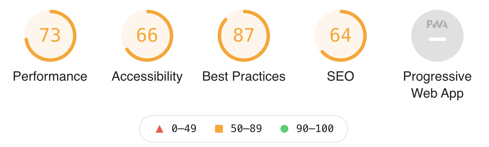
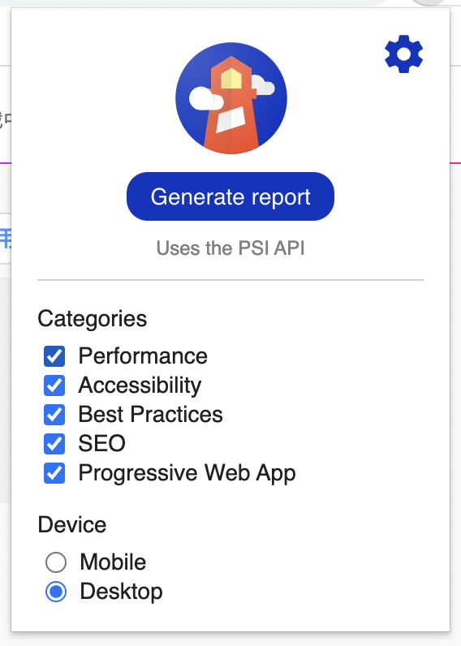
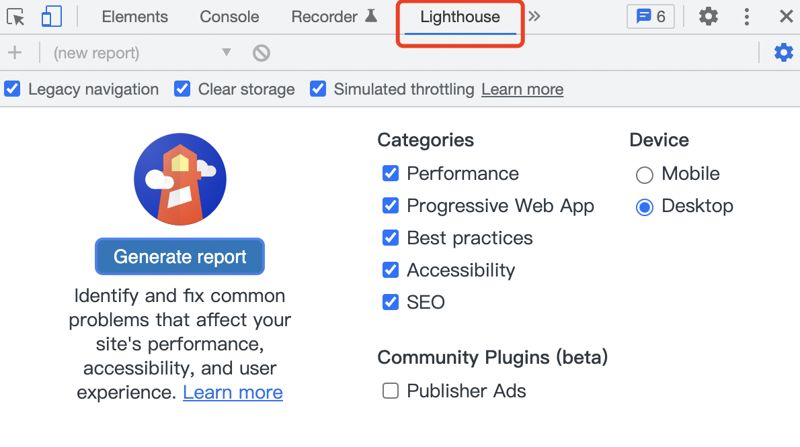

[前端性能优化](https://csmsimona.github.io/myDocs/#/zh-cn/%E5%89%8D%E7%AB%AF%E5%9F%BA%E7%A1%80%E6%B1%87%E6%80%BB/JavaScript%E5%B0%8F%E8%AE%B0?id=%e6%80%a7%e8%83%bd%e4%bc%98%e5%8c%96)


## 一、前端字体包引入优化

在字体加载的期间，浏览器页面是默认不展示文本内容的。即我们常说的 FOIT (Flash of Invisible Text)。

在现代浏览器中，FOIT 持续至多 3 秒，会带来糟糕的用户体验。


### 1、字体格式介绍

#### TTF

TTF (TrueType Font) 字体格式是由苹果和微软为 PostScript 而开发的字体格式。在 Mac 和 Windows 操作系统上，TTF 一直是最常见的格式，所有主流浏览器都支持它。然而，**IE8 不支持 TTF；且 IE9 上只有被设置成 "installable" 才能支持**。

TTF 允许嵌入最基本的[数字版权管理](https://link.zhihu.com/?target=https%3A//zh.wikipedia.org/wiki/%E6%95%B0%E5%AD%97%E7%89%88%E6%9D%83%E7%AE%A1%E7%90%86)标志————内置标志可以告诉我们字体作者是否允许改字体在 PDF 或者网站等处使用，所以**可能会有版权问题**。另一个缺点是，TTF 和 OTF 字体是没压缩的，因此他们**文件更大**。

#### OTF

OTF (OpenType Font) 由 TTF 演化而来，是 Adobe 和微软共同努力的结果。OTF 字体包含一部分屏幕和打印机字体数据。OTF 有几个独家功能，包括支持多平台和扩展字符集。OTF 字体可以在 Macintosh 和 Windows 系统上使用。

OTF 也允许多达 65000 个字符的存储。这个额外的空间让设计师可以自由地添加附加元素，比如小帽子、老式数字体、代替的字符和其他一些以前必须作为独立字体分发的附加材料。

#### EOT

EOT (Embedded Open Type) 字体是微软设计用来在 Web 上使用的字体。是一个在网页上试图绕过 TTF 和 OTF 版权的方案。你**可以使用微软的工具从现有的 TTF/OTF 字体转成 EOT 字体使用**，其中对字体进行压缩和裁剪使得文件体积更小。同时为了避免一些收版权保护的字体被随意复制，EOT 还集成了一些特性来阻止复制行为，以及对字体文件进行加密保护。 EOT 格式**只支持IE** 。

#### WOFF

WOFF (Web Open Font Format) 本质上是 metadata + 基于 SFNT 的字体（如 TTF、OTF 或其他开放字体格式）。该格式完全是为了 Web 而创建，由 Mozilla 基金会、微软和 Opera 软件公司合作推出。 WOFF 字体均经过 WOFF 的编码工具压缩，**文件大小一般比 TTF 小 40%，加载速度更快**，可以更好的嵌入网页中。metadata 允许在字体文件中包含许可数据，以解决版权问题。这是万维网联盟提倡的，所以毫无疑问的是字体格式的未来。**目前主流的浏览器的新版本几乎都支持 WOFF。**

WOFF2 是 WOFF 的下一代。 WOFF2 格式在原有的基础上提升了 30% 的压缩率。由于它还没有 WOFF 的广泛支持，所以还只是一个可展望的升级。

#### SVG

SVG (Scalable Vector Graphics font) 字体格式使用 SVG 的字体元素定义。**这些字体包含作为标准 SVG 元素和属性的字形轮廓，就像它们是 SVG 映像中的单个矢量对象一样。**SVG 字体最大的缺点是缺少字体提示（font-hinting）。字体提示是渲染小字体时为了质量和清晰度额外嵌入的信息。同时，**SVG 对文本（body text）支持并不是特别好**。因为 SVG 的文本选择（text selection）目前在 Safari、Safari Mobile 和 Chrome 的一些版本上完全崩坏，所以你**不能选择单个字符、单词或任何自定义选项，你只能选择整行或段落文本**。

然而，如果你的目标是 iPhone 和 iPad 用户，需要说 SVG 字体是 iOS 上 Safari 4.1 以下唯一允许的字体格式。


#### 字体兼容性处理方法

```css
@font-face {        
  font-family: 'YourWebFontName';        
  src: url('YourWebFontName.eot'); /* IE9 Compat Modes */        
  src: url('YourWebFontName.eot?#iefix') format('embedded-opentype'), /* IE6-IE8 */             
    url('YourWebFontName.woff') format('woff'), /* Modern Browsers */             
    url('YourWebFontName.ttf')  format('truetype'), /* Safari, Android, iOS */             
    url('YourWebFontName.svg#YourWebFontName') format('svg'); /* Legacy iOS */   
}
```

#### 字体非兼容

目前主流浏览器都支持.woff格式，所以如果不考虑兼容性问题的话可以放心的使用woff字体格式。


### 2、开启CDN

把不常更改的静态资源做CDN处理，以减少页面响应时间


会出现的问题：字体文件在CDN服务器上、项目部署在自己的服务器上，字体文件就出现了跨域加载的问题。

CDN服务器设置Access-Control-Allow-Origin，允许目标域名访问

```java
add_header Access-Control-Allow-Origin *;
```


### 3、开启 gzip 加速

通过`nginx`开启`gzip`压缩传输

```shell
# 开启和关闭gzip模式
gzip on|off; 
# gizp压缩起点，文件大于1k才进行压缩
gzip_min_length 1k; 
# gzip 压缩级别，1-9，数字越大压缩的越好，也越占用CPU时间
gzip_comp_level 5; 
# 进行压缩的文件类型。 
gzip_types text/plain application/javascript application/x-javascript text/css application/xml text/javascript font/ttf; 
#nginx对于静态文件的处理模块，开启后会寻找以.gz结尾的文件，直接返回，不会占用cpu进行压缩，如果找不到则不进行压缩 
gzip_static on|off 
# 是否在http header中添加Vary: Accept-Encoding，建议开启
gzip_vary on; 
# 设置压缩所需要的缓冲区大小，以4k为单位，如果文件为7k则申请2*4k的缓冲区 
gzip_buffers 2 4k; 
# 设置gzip压缩针对的HTTP协议版本 
gzip_http_version 1.1;
```


### 4、转WOFF/WOFF2

#### TTF 字体转 WOFF/WOFF2

- [ttf-to-woff2](https://everythingfonts.com/ttf-to-woff2)（1M以内）

- [webfont-generator](https://www.fontsquirrel.com/tools/webfont-generator)

-  node 库 [ttf2woff2](https://www.npmjs.com/package/ttf2woff2) 

  ```shell
  $ font.ttf | ttf2woff2 > font.woff2
  ```

  

#### OTF 转 WOFF/WOFF2

- [otf-to-ttf](https://cloudconvert.com/otf-to-ttf)

- python 库 [otf2ttf](https://link.juejin.cn?target=https%3A%2F%2Fgithub.com%2Fawesometoolbox%2Fotf2ttf)

  ```shell
  $ pip install  otf2ttf
  $ otf2ttf MyFont.otf
  ```

  

### 5、font-spider（字蛛）减少ttf字体文件大小

[字蛛](https://github.com/aui/font-spider)是一个智能 WebFont 压缩工具，它能自动分析出页面使用的 WebFont 并进行按需压缩。


1.全局安装

```shell
npm install font-spider -g
```

2.定义字体并使用

```css
@font-face {
  font-family: "Orbitron";
  src: url("./Orbitron-VariableFont_wght.ttf");
}
.text {
  font-family: "Orbitron";
}
```

将常用的3500个中文字存储起来，然后通过font-spider来进行提取， 3500个字体可以包含99%的中文

https://www.haomeili.net/zhishi/45

3.执行命令，分离字体

```shell
font-spider index.html
```

字体包更新，初始字体包被放置在.font-spider文件夹中


**类似的WebFont (Web Open Font Format) 技术**

[fontmin](http://ecomfe.github.io/fontmin/#usage)

[iconfont](https://www.iconfont.cn/webfont/#!/webfont/index)

[有字库](http://www.youziku.com/)


### 6、统一渲染时机

先使用系统默认字体，等到远程字体加载完成了再替换成特殊字体。


#### WebFontLoader

1.在 css 中通过 @font-face 定义一个字体：

```css
@font-face {
  font-family: "Orbitron";
  src: url("./Orbitron-VariableFont_wght.ttf");
}
```

2.引入 webfontloader  (也可以通过 npm 安装)，将你在 css 中定义的字体名称添加到 `custom.families` 列表中，并在 active 回调中将该字体添加到对应的元素上，代码如下：

```html
<script src="https://ajax.googleapis.com/ajax/libs/webfont/1.6.26/webfont.js"></script>
<script>
WebFont.load({
  custom: {
    families: ['Orbitron'],
  },
  classes: false,
  active() {
    document.body.style.fontFamily = 'Orbitron';
  },
});
</script>
```


#### [font-display](https://developer.mozilla.org/zh-CN/docs/Web/CSS/@font-face/font-display)

`font-display` 属性决定了一个@font-face 在不同的下载时间和可用时间下是如何展示的。


可以在 `@font-face` 中设置 `font-display: swap`，让 FOIT 的默认行为变为 FOUT (Flash of Unstyled Text)，即先会使用默认字体样式展示文本，字体加载完毕后再将文本的字体样式进行替换。

```CSS
@font-face {
  font-family: "Orbitron";
  src: url("./Orbitron-VariableFont_wght.ttf");
  font-display: swap;
}
```

[font-display兼容性](https://caniuse.com/css-font-rendering-controls)


## 二、性能检测工具Lighthouse

### 1、简介

Lighthouse 是一款检测网页质量的自动化工具，Google提供的开源软件，任何网站都可以免费使用。可以检查的网站性能、可访问性、SEO等，并给出优化建议。





### 2、安装使用

- Chrome Devtool

  

- Chrome 扩展程序

  

- 命令行安装

  ```shell
  $ npm i lighthouse -g
  $ lighthouse https://www.baidu.com/ --view
  ```

  

### 3、评分指标

1、**FCP（First Contentful Paint）**： 首屏加载时间

- 用户开始输入url（开始导航） 到页面出现东西（浏览器渲染第一段DOM。图片、非白色的 < canvas > 元素和 svg 被认为是 DOM 内容，iframe中的任何内容不包含在内）。
- 这个指标对于没有使用ssr技术的web app意义并不大，因为第一绘制发生的时间通常JS还没加载完毕。

2、**SI（Speed Index）**：速度指数（分数越低越好）

- 衡量页面加载期间内容的视觉显示速度。
- 它要求的是页面的渲染过程应该是渐进的，内容一点点出现，而不是开始一段时间一直是空白，然后全部内容一下出现。
- 这个指标跟页面渲染时间和渲染方式有关，如果页面渲染时间很短，页面一下就出来了，那它的得分也会很高。该指标权重为 10%

3、**TTI（Time to Interactive）**：首次可操作（比如可点击可滚动）

- 衡量一个页面需要多长时间才能完全交互
- 主要影响因素就是页面渲染速度和 JS 阻塞时间。

4、**TBT（Total Blocking Time）**：总阻塞时间

- 在FCP和TTI之间，所有超过50ms的long task的超过时间之和
- 要求我们所有的 JS 任务(宏任务，一般是函数)执行时间不要大于 50 ms

5、**LCP（Largest Contentful Paint）**：当前页面上”最大的内容“渲染时间

- 衡量页面的主要内容对用户可见的时间

6、**CLS（Cumulative Layout Shift）**：累积布局移位

- 网页布局在加载期间的偏移量，普遍用于测量视觉稳定性。

- 得分范围是0－1，其中0表示没有偏移，1表示最大偏移。要求我们在渲染页面过程中，不要频繁发生内容块的偏移。


### 4、常见问题

##### 1. Use HTTP/2

http1.1替换为http2.0后可使用二进制标头和多路复用（可以只通过一个 TCP 连接就可以传输所有的请求数据，并行请求）。

##### 2. Remove unused CSS 或者 Remove unused JavaScript（移除无用的js和css）

##### 3. Serve static assets with an efficient cache policy（为静态资源提供缓存）

##### 4. Reduce JavaScript execution time 减少js的执行时间

当JavaScript执行时间超过2秒时，Lighthouse将显示警告。执行时间超过3.5秒时，审核将失败

- 拆分代码
- 缩小并压缩代码
- 删除未使用的代码 (tree shaking)
- 使用缓存代码

